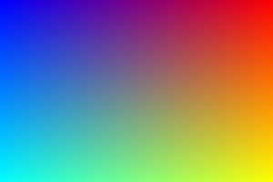

= Write a TGA file with Zig

**MOVED!** Hello, I am moving my repos to http://ratfactor.com/repos/
and setting them to read-only ("archived") on GitHub. Thank you, _-Dave_

This program demonstrates writing
https://en.wikipedia.org/wiki/Truevision_TGA[TGA]
"targa" image files by writing a pretty gradient.

TGA is easy to write and has wonderfully software support, but there are a
couple "gotchas" in the header and image data, namely:

* An image "origin" is specified in two places in the header -
  get it wrong and you'll be scratching your head at the mess on the screen.
* Pixels are in Blue Green Red order, not RGB.

